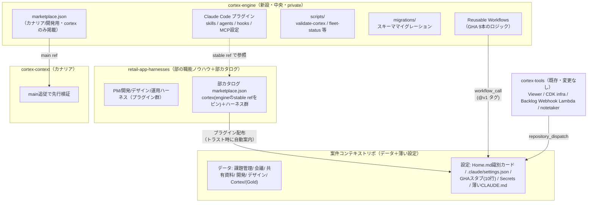

# Cortex エンジン/データ分離 設計書

> 2026-07-06 に cortex-context の tmp/ から正本を移設。v1（2026-07-31 リリース）の設計全体像。


- 作成日: 2026-07-05
- ステータス: ドラフト（レビュー待ち）
- 前提決定:
  - フレームワークとデータを分離し中央で版管理する
  - **Claude Code 専用**とする（Cursor 対応を落とす。Cursor 利用者はごく少数のため移行影響は軽微、個別周知のみ）
  - **本設計を Cortex v1（2026-07-31 リリース）として出す**。テンプレ方式での v1 リリースは行わない（2026-07-05 確定）

## 1. 目的と背景

### 解決する課題: 「更新の税」

現行の Cortex はテンプレート（aidd-project-cortex）を「Use this template」で**複製**して案件リポを作る方式である。テンプレ側の改善（スキル修正・ワークフロー修正・バグ修正）は、複製済みの各案件リポに `/update-from-template` で**手動伝播**する必要があり、この作業は案件数に比例して増える。案件が 10 に増える将来、テンプレを 1 行直すたびに 10 リポを回る運用は成立しない。

### 解決方針

案件リポには**コンテキストデータ（Bronze/Silver/Gold）と薄い設定だけ**を置き、Cortex を動かす仕組み（スキル・ワークフロー・スクリプト＝**エンジン**）は中央リポジトリで一元的に版管理する。エンジンのバージョンが上がれば全案件に自動反映され、案件側でのテンプレ追従作業を廃止する。

```
旧: テンプレ ──複製──> 案件リポ（データ＋仕組みが同居）──手動追従──> 更新の税
新: エンジン（中央・版管理）──自動配信──> 案件リポ（データ＋薄い設定のみ）
```

## 2. 設計原則

1. **案件リポ＝データに純化する**: 議事録・課題・資料・Gold 層と、案件固有の設定（識別カード・secrets・薄いスタブ）のみを置く。ロジックを置かない
2. **エンジン＝中央で版管理**: スキル・サブエージェント・フック・GitHub Actions ロジック・スクリプト・マイグレーションを 1 リポで管理し、リリース単位で配布する
3. **自動反映は無条件にしない**: 案件は安定チャンネルに固定し、ドッグフーディングリポ（cortex-context）がカナリアとして先行検証する。「改善が自動で降ってくる」と「バグが全案件に同時に降る」を切り分ける
4. **カスタマイズは「編集」から「設定」へ**: 案件差分は設定値（Home.md の識別カード）でエンジンが分岐する。設定で表現できない変則案件のために eject（能力単位のローカル上書き）の口を残す
5. **スキーマとデータの結合はマイグレーションで解く**: エンジン更新が frontmatter・ディレクトリ構造の変更を伴う場合に備え、schema_version とマイグレーション機構を最初から持つ
6. **Claude Code 専用**: rulesync による多ツール対応（`.rulesync/` 正本→生成物の二重構造）を廃止し、Claude Code プラグインを唯一の配布形態とする
7. **エンジンは部署非依存**: cortex-engine に部署固有のコンテンツ（職能ハーネス・部のプロダクト前提）を置かない。将来の他部署展開時に、エンジンをそのまま配れる状態を保つ。依存方向は**ハーネス→エンジン（規約・schema）の一方向のみ**で、エンジンはハーネスを一切知らない（エンジンに keystone 等の部のプロダクト名が現れたら設計違反）

## 3. 全体アーキテクチャ



- **cortex-engine（新設・部署非依存）**: エンジンの正本。プラグイン・reusable workflows・スクリプト・マイグレーションを同居させ、**1 つの git ref で全構成要素のバージョンが揃う**ようにする。部署固有コンテンツは置かない（§2 原則 7）。v1 では `classmethod-team-app` org に置き、他部署展開が見え始めた時点で中立的な置き場所へ移設する
- **部カタログ（retail-app-harnesses に同居）**: 配布の入口。marketplace.json だけの薄い層で、cortex（エンジンの `stable` ref を独立ピン）と部の職能ハーネスを掲載する。**カタログは部が所有し、エンジンは参照される側に徹する**。他部署が導入する際は、その部署が自分のカタログ（cortex＋自部署ハーネス）を作るだけで、エンジンは変更不要
- **案件コンテキストリポ**: データと薄い設定のみ。部カタログを「参照」する
- **cortex-context**: 唯一 main（最新）追従のカナリア。ここで一定期間問題がなければ安定チャンネルを前進させる
- **cortex-tools / cortex-notetaker**: 変更なし。案件リポへの `repository_dispatch` 起動は今後も案件リポ側のスタブが受ける

## 4. cortex-engine リポジトリ構成

```
cortex-engine/
├── .claude-plugin/
│   └── marketplace.json          # カナリア/開発用（cortexのみ相対パス掲載。配布の正本は部カタログ→§5.1）
├── plugin/                       # Claude Code プラグイン本体
│   ├── .claude-plugin/plugin.json
│   ├── skills/                   # 現行 .rulesync/skills の25本を移設
│   │   ├── setup-project/        # 新規案件のscaffold（旧テンプレの役割を吸収）
│   │   ├── backlog-pull/  backlog-push/  post-meeting/  create-minute/
│   │   ├── update-decision-log/  update-glossary/  weekly-report/
│   │   ├── catch-up-recent-status/  cortex-grep/  onboard-member/
│   │   ├── sync-materials/  sync-designs/  read-chat/  clone-dev-repos/
│   │   ├── git-save/  git-pull/  git-fix-push/
│   │   ├── customize-tooling/  submit-feedback/  setup-status/
│   │   └── （auto系: update-decision-log-auto / update-glossary-auto）
│   ├── agents/                   # 旧 .rulesync/subagents（planner 等）
│   ├── hooks/                    # 旧 .rulesync/hooks（worktree-setup 等）
│   ├── mcp.json                  # 旧 .rulesync/mcp.json
│   └── scripts/                  # スキルが使うスクリプト（${CLAUDE_PLUGIN_ROOT} で参照）
├── .github/workflows/            # reusable workflows（on: workflow_call）
│   ├── sync-backlog.yml  backlog-webhook-sync.yml  ingest-minutes.yml
│   ├── update-gold.yml  weekly-report.yml
│   ├── sync-designs.yml  fleet-status.yml  validate-cortex.yml
│   └── engine-migrate.yml        # 【新規】スキーママイグレーション実行
├── scripts/                      # GHA用スクリプト（validate-cortex.mjs / fleet-status.mjs）
├── migrations/                   # スキーママイグレーション（§8）
│   └── 0001-初期スキーマ確立.mjs
├── docs/                         # オントロジー・データ階層・運用原則の正本（§7）
└── scaffold/                     # 案件リポの初期骨格（setup-projectが展開）
```

**規約の正本もエンジンに移す**: オントロジー（`ontology.md`）・探索戦略・公開範囲ルール等は、これまで各リポの `CLAUDE.md` / `.claude/rules/` に複製されていた。本設計ではエンジンの `docs/` を正本とし、案件リポの CLAUDE.md には「エンジン管理ブロック」として必要最小限を書き込む（更新はマイグレーションが行う。§7）。

## 5. 配布メカニズム（3 経路）

エンジンの構成要素ごとに、Claude Code / GitHub Actions の標準機構で配布する。**独自の配布の仕組みは作らない**。

### 5.1 スキル等 → Claude Code プラグイン

配布の入口は**部カタログ**（retail-app-harnesses リポに同居する marketplace.json）とし、エンジンは参照される側に徹する。案件リポの `.claude/settings.json` で部カタログを参照すると、リポをトラストしたメンバーには自動でインストールが案内される（公式仕様で確認済み）。

```jsonc
// 部カタログ: retail-app-harnesses/.claude-plugin/marketplace.json
{
  "name": "retail-app",
  "plugins": [
    { "name": "cortex",                      // エンジン本体（別リポを独立ピン）
      "source": { "source": "github", "repo": "classmethod-team-app/cortex-engine", "ref": "stable" } },
    { "name": "pm-harness",                  // 部の職能ハーネス（案件が opt-in）
      "source": "./plugins/pm-harness", "defaultEnabled": false },
    { "name": "dev-harness", "source": "./plugins/dev-harness", "defaultEnabled": false }
  ]
}
```

```jsonc
// 案件リポの .claude/settings.json（安定チャンネル）
{
  "extraKnownMarketplaces": {
    "retail-app": {
      "source": { "source": "github", "repo": "classmethod-team-app/retail-app-harnesses" }
    }
  },
  "enabledPlugins": {
    "cortex@retail-app": true,
    "pm-harness@retail-app": true    // 使う職能ハーネスだけ案件が宣言
  }
}
```

```jsonc
// cortex-context の .claude/settings.json（カナリア: エンジンリポを直接参照）
{
  "extraKnownMarketplaces": {
    "cortex-canary": {
      "source": { "source": "github", "repo": "classmethod-team-app/cortex-engine" }
      // ref省略 = mainの最新に追従。エンジン同梱の marketplace.json（cortexのみ掲載）を使う
    }
  },
  "enabledPlugins": {
    "cortex@cortex-canary": true
  }
}
```

設計上のポイント（公式ドキュメントで検証済みの仕様に基づく）:

- **カタログとエンジンの分離**: マーケットプレイスのエントリは別リポのプラグインを `ref`/`sha` で**独立にピン**できる（マーケットプレイス自身のピンとプラグインのピンは独立、と公式に明記）。この性質により「配布は部カタログ 1 つ・実体はエンジンと部ハーネスで別リポ」が成立する
- **バージョン解決**: `plugin.json` の `version` は**設定しない**。省略すると git コミット SHA がバージョンとして扱われ、push のたびに新バージョンとして配信される（「内部向け・活発に開発中のプラグインに最も単純」と公式が推奨する構成）。`version` を設定すると bump 忘れ＝配信されない事故が起きるため採用しない
- **チャンネルの実現**: 安定＝部カタログがエンジンの `stable` ブランチをピン（**エンジンチームが stable を前進させるだけで全案件に届く。カタログの編集は不要**）。カナリア＝cortex-context がエンジンリポを直接マーケットプレイスとして参照（main 追従。エンジン同梱の marketplace.json は cortex を `./plugin` 相対パスで掲載するカナリア/開発用）。マーケットプレイス状態はユーザー単位で管理されるため（`~/.claude/plugins/known_marketplaces.json`）、名前を `retail-app` / `cortex-canary` と分けて衝突を避ける
- **職能ハーネスの掲載**: 部カタログに `defaultEnabled: false` で載せ、案件リポの `enabledPlugins` で opt-in する。「カタログには部の全能力が載っているが、有効になるのは案件が宣言したものだけ」となり、Home.md 識別カードと同じ「案件側の薄い設定が選択する」思想に揃う。ハーネスのリリース主導権は各ハーネスチームに残る（自リポの更新だけで配信される）
- **他部署展開**: 新しい部署は「自部署カタログ（cortex＋自部署ハーネス）」を 1 ファイル作るだけで導入できる。エンジンには手を入れない
- **private リポ対応**: プラグインの手動インストール/更新は既存の git 認証（`gh auth login` 等）をそのまま使う。**起動時のバックグラウンド自動更新だけは環境変数の認証トークンが必要**（対処は下記「メンバーの導入体験」）
- **スクリプト同梱**: スキルが呼ぶスクリプトはプラグイン内に置き `${CLAUDE_PLUGIN_ROOT}` で参照する（プラグインはキャッシュにコピーされるため、プラグイン外への相対参照は不可という仕様に従う）
- **スキル名の互換**: 利用者から見たスキル名は現行と同じ `/backlog-pull` 等を維持する（プラグインスキルとして提供）。将来スキルを改名・廃止する場合は marketplace.json の `renames` フィールドで自動移行できる

### 5.1.1 メンバーの導入体験（ゼロタッチ配布）

部の全メンバー展開を想定し、**メンバーがマーケットプレイスやプラグインの存在を意識せずに使える**ことを設計要件とする。上記の settings.json 方式で、体験は次のとおりになる。

- **初回**: 案件リポを Claude Code で開き、フォルダをトラストすると「このプロジェクトは cortex プラグインを使います」という確認が自動で表示される。**「はい」を 1 回押すだけ**（コマンド入力・マーケットプレイスの理解は不要）
- **2 案件目以降**: プラグインの状態はユーザー単位（`~/.claude/plugins/`）で管理されるため、**インストールは 1 人 1 回きり**。別案件のリポを開いても同じプラグインがそのまま使われる。案件が増えてもメンバーの作業は増えない
- **環境要件の消滅**: 現行のテンプレ方式で必要だった mise / pnpm / rulesync のセットアップが不要になる（Node 環境すら不要）。非エンジニアメンバーのオンボーディングは現行より軽くなる
- **蓄積はメンバー状態と無関係**: 夜間の自動化（同期・精製・レポート）は GitHub Actions 側で動くため、プラグイン未導入のメンバーがいてもコンテキストの蓄積は止まらない。プラグインは「そのメンバーがスキルを使えるか」だけに効く

**唯一残る初回摩擦＝自動更新トークン**: private マーケットプレイスのバックグラウンド自動更新には環境変数の認証トークンが必要（未設定だと静かにスキップされ、手元のプラグインが古いまま残る）。これを放置すると「改善が自動で降ってくる」思想と矛盾するため、**`/onboard-member` スキルにトークン設定を 1 ステップとして組み込む**。具体的には、1Password の環境（Backlog API キー等の既存運用）に cortex-engine への read 専用 GitHub トークンを追加し、onboard-member がメンバーの環境変数への設定まで案内する。メンバー体験は「オンボーディングで 1 回設定したら以後意識しない」に収まる。

### 5.2 GitHub Actions → Reusable Workflows

現行 9 本のワークフローのロジックをエンジン側に `on: workflow_call` で置き、案件リポには**トリガー定義と呼び出しだけの薄いスタブ**を残す。

```yaml
# 案件リポの .github/workflows/sync-backlog.yml（スタブ・これで全部）
name: Backlog同期
on:
  schedule:
    - cron: "0 0-10 * * 1-5"   # トリガー（cron時刻）は案件側の裁量で調整可
  workflow_dispatch:
jobs:
  sync:
    uses: classmethod-team-app/cortex-engine/.github/workflows/sync-backlog.yml@v1
    secrets: inherit
```

- **バージョン参照**: 案件は `@v1`（メジャーバージョンの移動タグ。actions/checkout 等と同じ運用）、cortex-context は `@main`。エンジンのリリース時に `v1` タグを前進させると全案件に反映される
- **トリガーは案件側に残す**: `schedule` / `repository_dispatch`（Backlog Webhook Lambda・cortex-notetaker からの起動）はスタブが受ける。cortex-tools 側の艦隊レジストリ・dispatch 先は**変更不要**
- **secrets は案件リポに残す**: `secrets: inherit` で渡す。エンジンには秘密を置かない
- **private リポ間の共有設定**: cortex-engine の Settings → Actions → Access を「組織内のリポジトリからアクセス可能」にする（org 内 private/internal リポ間の reusable workflow 共有は GitHub の標準機能）
- **GHA スクリプトの参照**: reusable workflow は呼び出し元コンテキストで動くため、エンジンのスクリプトが必要なステップでは `actions/checkout` で cortex-engine を同一 ref でチェックアウトして実行する
- **cron 上で Claude Code を使うワークフロー**（update-decision-log 等）: チェックアウトしたエンジンのプラグインを `CLAUDE_CODE_PLUGIN_SEED_DIR`（CI 向けにプラグインを事前展開する公式機構）で読み込ませ、ローカル実行と同一のスキルで動かす

### 5.2.1 main へ書き込むワークフローの規約（堅牢 push ＋ 直列化）

案件リポの `main` に commit/push する reusable workflow は、**必ず次の2点を満たす**。新規ワークフローを追加するときも同じ方針で作る。

1. **push は共有 composite action に委譲する**（`git push` のループを各ワークフローに書かない）。ワークフロー側は staging と commit まで行い、push は次を呼ぶだけにする:

   ```yaml
   - name: 堅牢push（未ステージ畳み込み・衝突自動解決・リトライ）
     uses: classmethod-team-app/cortex-engine/.github/actions/robust-push@v1
     with:
       token: ${{ secrets.GITHUB_TOKEN }}
   ```

   `robust-push` は (a) 未ステージの生成差分を `commit --amend` で畳んでから rebase し（`unstaged changes` での rebase 拒否を防ぐ）、(b) 同期ミラーの再生成ファイル（`backlog-settings.json` / `backlog-update.log` 等）の rebase 衝突は最新側を採用して自動解決し、(c) 最大5回リトライする。正本は action の1箇所（`.github/actions/robust-push/`）に集約し、`@v1` で reusable workflow と版を揃える。

2. **job-level concurrency で直列化する**。同一リポ内で `main` に書き込むワークフローを1グループにまとめ、push 競合の発生自体を減らす:

   ```yaml
   jobs:
     <job>:
       concurrency:
         group: cortex-repo-write-${{ github.repository }}
         cancel-in-progress: false
   ```

**背景**: リアルタイム同期の追加で push 競合が頻発し、`backlog-settings.json` の rebase 衝突・未ステージ拒否で同期系 CI が常態的に失敗した（2026-07）。真因は Gold 生成ロジックではなく、各ワークフローにコピペされた脆弱な push ループ。共有 action 化でコピペ再発を断ち、規約を「文章」ではなく「呼び出す部品」で強制する。読み取り専用の CI（`validate-cortex` 等）は `main` に書かないため対象外。

### 5.3 検証スクリプト → エンジン同梱（npm 公開はしない）

`validate-cortex.mjs` / `fleet-status.mjs` はエンジンリポに置き、(a) ローカルではプラグイン同梱コピーを、(b) GHA ではチェックアウトしたエンジンのものを使う。npm パッケージ公開は配布経路を増やすだけなので行わない（正本は 1 つ、参照は 2 経路）。

## 6. バージョニングとリリースフロー

```
main（開発）──毎push──> cortex-context（カナニア: plugin=main追従 / GHA=@main）
   │
   │  数日〜1週間、夜間cron・定例運用で問題なし
   ▼
stable ブランチ & v1 タグを前進 ──自動──> 全案件（plugin=stable / GHA=@v1）
```

- **リリース＝2 つの ref の前進**: `stable` ブランチ（プラグイン用）と `v1` タグ（GHA 用）を同一コミットに進める。この操作はエンジンリポの release ワークフローで 1 コマンド化する（2 つの ref がズレる事故を防ぐ）
- **破壊的変更**: データスキーマの変更・スタブ側の書き換えが必要な変更はメジャーバージョンを上げ（`v2` タグ・`stable-v2` ブランチ）、マイグレーション（§8）とセットでリリースする
- **フリートの可視化**: `fleet-status.json` に `engineVersion`（プラグインの解決バージョン=コミット SHA）・`schemaVersion`・`channel` を追加する。巡回エージェントがフリート全体のバージョン分布と更新遅延を監視できる

## 7. 案件リポの最終形（データ＋薄い設定）

```
{案件リポ}/
├── CLAUDE.md                  # 薄い。エンジン管理ブロック＋案件固有の注意書きのみ
├── .claude/settings.json      # マーケットプレイス参照＋enabledPlugins（§5.1）
├── .github/workflows/         # 10行スタブ × 本数分（§5.2）
├── Cortex/                    # Gold層（Home.md = 設定の単一表面）
├── 課題管理/ 会議/ チャット/ 共有資料/ 開発/ デザイン/   # データ（現行と同じ）
└── tmp/
```

**消えるもの**: `.rulesync/` 一式、`rulesync.jsonc`、`package.json`/`pnpm-lock.yaml`（rulesync・validate 用依存）、`scripts/`、生成物としての `.claude/skills` 等、`node_modules`。

### Home.md 識別カード＝設定の単一表面

既存の識別カード（kind / tools / lifecycle 等）に、エンジン関連を追加する:

```yaml
# エンジン設定（本設計で追加）
engine:
  channel: stable        # stable | canary（表示用。実体は settings.json とスタブの ref）
  schema_version: 1      # データスキーマ版。マイグレーションが更新する（手編集しない）
```

`tools:` マップ（能力→ツール）は現行どおりで、**エンジン側スキル・ワークフローの分岐入力に昇格**する（例: `課題管理: jira` なら backlog 系スキルは Jira 実装で動く…は将来。本リリース時点では applicability 判定＝対象外スキップに使う現行機能を維持）。

### CLAUDE.md の扱い

- 案件リポの CLAUDE.md は「**エンジン管理ブロック**」（マーカーコメントで囲む）と「**案件固有ブロック**」に分ける
- エンジン管理ブロックには、**プラグインなしの素の Claude Code でも案件リポを歩けるだけの内容**を残す: データ階層（Bronze/Silver/Gold）の要点・Gold 起点の探索戦略・公開範囲の原則。これは顧客（AIS）がプラグインなしでリポを開くケースの生命線なので、リポから消さない（§9）
- エンジン管理ブロックの更新はマイグレーション（§8)が行い、手では編集しない。案件固有ブロックは自由編集

## 8. スキーママイグレーション機構

**この設計の最重要部品。** エンジン（コード）は中央で上げられるが、各案件リポに散在するデータ（frontmatter・ディレクトリ構造・CLAUDE.md）は自動では変わらない。ここを機構化しないと「更新の税」がデータマイグレーションの形で復活する。

- **schema_version**: 案件リポの現在のデータスキーマ版（Home.md 識別カード）。エンジンは自分が要求する `requiredSchemaVersion` を持つ
- **マイグレーションファイル**: `cortex-engine/migrations/NNNN-説明.mjs`。各ファイルは `{ from, to, description, autoApply: boolean, run(repoRoot) }` を実装する。冪等に書く
- **実行経路**: 専用の reusable workflow `engine-migrate.yml`（案件スタブ: 夜間 cron ＋ workflow_dispatch）が、リポの schema_version とエンジンの要求版を比較し、未適用マイグレーションを順に実行する
  - `autoApply: true`（機械的・可逆・追記系）→ 実行して直コミット（validate-cortex を通してから push）
  - `autoApply: false`（既存レコードの書き換え・非可逆）→ 実行結果を **PR として起票**し人間がレビュー（Gold 層運用原則「自動化は新規追加のみ・既存レコードは書き換えない」と整合させる）
- **順序保証**: 夜間の他ワークフロー（decision-log 等）は冒頭で schema_version を確認し、エンジン要求版より古ければ**その夜はスキップ**する（migrate 完了後の翌夜から再開）。半端なスキーマで精製ジョブを走らせない
- **旧 `/update-from-template` は廃止**。その役割（構造変更の取り込み）はこの機構が置き換える

## 9. カスタマイズと公開範囲

### カスタマイズ（設定駆動＋eject）

1. **第一選択＝設定**: Home.md の `tools:` マップと識別カードでエンジンが分岐する
2. **eject（能力単位のローカル上書き）**: 設定で表現できない変則案件は、(a) 該当ワークフロースタブを自前実装に差し替える、(b) 案件リポの `.claude/skills/` にローカルスキルを置く（プラグインスキルと名前空間が別なので共存できる。案件の CLAUDE.md 固有ブロックに「この案件は /xxx の代わりにローカルの /yyy を使う」と明記する）。eject した能力はエンジン更新の対象外になることを受け入れる（fleet-status に eject 状況を報告項目として追加し、巡回が把握できるようにする）
3. `/customize-tooling` スキルは「リポ内スキルを書き換える」実装から「eject の型に沿ってローカル上書きを生成する」実装に改修する

### 公開範囲・顧客アクセス（AIS）

- **cortex-engine は private（組織内）**とする。スキル群はクラスメソッドのノウハウの結晶であり、公開しない
- 顧客が Claude Code で案件リポを開いた場合: private マーケットプレイスにはアクセスできないため**プラグインは入らない**。ただし §7 のとおり、CLAUDE.md のエンジン管理ブロックに探索戦略の要点を残すので、「経緯を教えて」「先週の動きは」といった**読み取り系の体験は成立する**（スキルは効率化であって前提ではない）
- Viewer（Gold 層閲覧）は cortex-tools 経由で従来どおり
- 顧客向けに書き込み系体験（課題返信の下書き等）まで開放したくなった場合は、public な軽量プラグイン（cortex-lite）を別途切り出す。**本リリーススコープ外**とする

## 10. 移行計画

| フェーズ | 内容 | 完了条件 |
| --- | --- | --- |
| **Phase 0: エンジン切り出し** | cortex-engine リポ新設。`.rulesync/skills` → プラグイン形式に変換（frontmatter 調整・`${CLAUDE_PLUGIN_ROOT}` 化）、GHA 9 本を workflow_call 化、marketplace.json・release ワークフロー・engine-migrate 骨格を作成 | ローカルで `/plugin marketplace add`（ローカルパス）して全スキルが動く。GHA を手元リポで workflow_dispatch 実行できる |
| **Phase 1: カナリア移行** | cortex-context を新構成に移行（settings.json・スタブ化・.rulesync 削除・schema_version 付与）。夜間 cron・notetaker 連携・Backlog Webhook を 1 週間運用 | 夜間ジョブが全て安定稼働し、fleet-status が engineVersion を報告する |
| **Phase 2: 艦隊移行** | 各案件リポを順次移行。移行自体をマイグレーション（`0001`）＋移行スキルとして実装し、最後の手動伝播とする | 全案件が stable チャンネルで稼働 |
| **Phase 3: テンプレ縮小** | aidd-project-cortex を「データ骨格＋スタブ＋settings.json」だけの scaffold に縮小（もしくはエンジンの `scaffold/` に吸収し、新規案件作成は `/setup-project` が空リポに展開する方式へ）。rulesync・update-from-template を正式廃止 | 新規案件が scaffold から 30 分で立ち上がる |

**v1 リリース（2026-07-31）との対応**: 本設計をそのまま v1 として出す（テンプレ方式での v1 リリースは行わない）。リリース基準は **Phase 0〜1 の完了**（エンジン稼働＋カナリアでの検証済み）を想定し、Phase 2（艦隊移行）はリリース後に順次、Phase 3 はその後とする（工数見積もりにより調整）。

## 11. 廃止一覧

| 廃止するもの | 置き換え |
| --- | --- |
| rulesync（`.rulesync/` 正本→生成物の二重構造・再生成フック・pre-commit） | プラグインが唯一の正本（Claude Code 専用化） |
| `/rulesync-generate` | 不要 |
| `/update-from-template` と手動伝播運用 | チャンネル自動配信＋スキーママイグレーション |
| 案件リポの `package.json` / `scripts/` / node_modules | エンジン同梱スクリプト |
| テンプレ複製方式（Use this template で仕組みごとコピー） | scaffold（データ骨格のみ）＋プラグイン |

## 12. 残る税（正直な見積もり）

ゼロにはならない。残るのは以下で、いずれも現行の「全リポを手で回る」より大幅に軽い。

- **スタブの変更**: トリガー追加・スタブ自体の形式変更はメジャーバージョンアップとしてマイグレーションで書き換える（頻度は低い）
- **非可逆マイグレーションの PR レビュー**: 案件数ぶんの PR を人間が承認する必要がある（安全のための意図的な残し）
- **secrets の追加**: 新しい外部連携を足すときは各リポに secret 登録が必要（これは性質上中央化できない。`gh secret set` の一括スクリプトで緩和）

## 13. 未決事項

なし（初版時点の未決事項はすべて解決済み。以下は経緯の記録）。

### 解決済み（経緯の記録）

- ~~v1（7/31）との関係~~ → **本設計を v1 として出す**ことに決定（2026-07-05。§10 参照）
- ~~職能ハーネス（retail-app-harnesses）との統合~~ → **カタログは部が所有し、エンジンは参照される側に徹する**（§3・§5.1）。エンジンの部署非依存を原則化（§2 原則 7）。将来の他部署展開時は各部署が自分のカタログを作る（2026-07-05）
- ~~エンジンリポの命名と org 配置~~ → **v1 では `classmethod-team-app/cortex-engine` に置く**。他部署展開が見え始めた時点で中立的な置き場所へ移設する（移設時のマーケットプレイス参照・GHA スタブの一斉更新はマイグレーションで実施できる）（2026-07-05）
- ~~Cursor 利用者への周知~~ → Cursor 利用者はごく少数のため懸念不要。個別周知のみで移行期限は設けない（2026-07-05）
- ~~プラグイン自動更新用トークンの配布方法~~ → `/onboard-member` に 1Password 経由の設定ステップとして組み込む（§5.1.1）

## 付録: 検証済みの仕様（一次ソース確認日: 2026-07-05）

本設計が依存する Claude Code プラグインの仕様は、公式ドキュメント（code.claude.com/docs の plugin-marketplaces）で以下を逐語確認済み。

- プラグイン source は `ref`（ブランチ/タグ）・`sha`（コミット）でピン留め可能。マーケットプレイス source は `ref` のみ対応（sha 不可）
- `version` フィールド省略時はコミット SHA がバージョンになり、push ごとに新バージョンとして配信される
- リリースチャンネルの公式パターンは「同一リポの異なる ref を指す別名マーケットプレイス × 2」
- リポの `.claude/settings.json` の `extraKnownMarketplaces` / `enabledPlugins`（`"plugin@marketplace": true` 形式）で、リポをトラストしたメンバーに自動インストールを案内できる
- private リポのプラグインは既存 git 認証で動作。バックグラウンド自動更新のみ環境変数トークンが必要
- プラグインはキャッシュへコピーされるため外部パス参照不可。`${CLAUDE_PLUGIN_ROOT}` でプラグイン内ファイルを参照する
- CI 向けに `CLAUDE_CODE_PLUGIN_SEED_DIR` でプラグインを事前展開できる
- マーケットプレイス状態はユーザー単位（`~/.claude/plugins/known_marketplaces.json`）で管理される（同名マーケットプレイスの ref 違い併用は不可 → 別名にする）
- `renames` フィールドでプラグインの改名・廃止を既存ユーザーに自動移行できる
